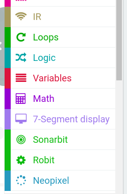

# testMicro-log

## Robit 

Robit https://www.micro-log.com/microbit/3371-shield-robit-v20.html
micro:bit y mbot https://juegosrobotica.es/podcast-034/

Tarjeta de expansión para construir robots con micro:bit.

La placa incluye:

	Tamaño para montar sobre chasis de mBlock.
	Emisor y receptor de infrarrojos.
	Conexiones para 2 motor paso a paso.
	Conexiones para 4 motor de C.C.
	Conexiones para 8 servomotores.
	1 Zumbador.
	2 Leds RGB programables.
	Pines de conexión
	Conectores RJ para motores y sensores de MakeBlock

https://www.elecfreaks.com/estore/elecfreaks-robit-diy-mini-smart-cars-robot-development-platform-chassis-for-micro-bit-compatible-with-mbot.html

### Extensión ""Robit"

Instalamos la extensión "Robit" que incluye otras extensiones como son neopixel, 7 segmentos display y sonarbit

### Sensor de distancia y pantalla 7 segmentos

Vamos a leer el sensor de distancia y mostramos la distancia en la pantalla de 7 segmentos

(Vemos como tenemos que declarar primero la variable strip con los datos de conexión de la pantalla)

[Proyecto](https://makecode.microbit.org/_DfiHqxT4gcCP)

### Movimientos básicos

Vamos a realizar unos movimientos básicos con los motores M1 y M2

Los activamos al pulsar el botón A

[Proyecto](https://makecode.microbit.org/_Cb7Tcv8uF73F)

## coche microbit 

https://www.micro-log.com/microbit/3283-coche-microbit.html
librerias https://github.com/lzty634158/yahboom_mbit_en

https://microbit.micro-log.com/

Robot diseñado sobre una placa de ampliación.

Incorpora:

Sensor Ultrasónico.

RGB.

Zumbador.

Emisor y detector infrarrojo.

Detector infrarrojo TSOP.

Optoacoplador para siguelineas.

Salidas para servos.

Conexión para motores.

Entradas/salidas analógicas/digitales.

2 Motores con reductora.

Zócalo para micro:bit.

Extension: robit

	Project	Parameter
	DC Power Input Voltage	DC 3.7-6V
	Li-battery Input Voltage	DC 3.7-4.2V
	USB Recharging Current	500mA
	Extendable Analog IO Ports	4
	Extendable Digital IO Ports	10
	Max Stepping Motor Driven Quantity	8
	DC Motor	4 Channels
	Stepping Motor	2 Channels
	Programmable LED Beads	2
	Passive Buzzer	Support
	Photocell Sensor	Support
	Infrared Receive	Support
	Infrared Send	Support
	Dimension	90mm X 74mm
	Net Weight	46g

https://www.elecfreaks.com/learn-en/microbitKit/robit_smart_car/index.html