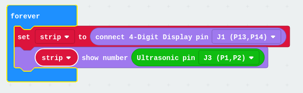

# testMicro-log

## Robit 

[Robit](https://www.micro-log.com/microbit/3371-shield-robit-v20.html) Es una placa que nos permite controlar el hardware de  un mbot usando una placa micro:bit y mbot https://juegosrobotica.es/podcast-034/

Tarjeta de expansión para construir robots con micro:bit.

La placa incluye:

	Tamaño para montar sobre chasis de mBlock.
	Emisor y receptor de infrarrojos.
	Conexiones para 2 motor paso a paso tipo 28BYJ-48
	Conexiones para 4 motor de C.C.
	Conexiones para 8 servomotores.
	1 Zumbador (P0)
	2 Leds RGB programables (P12)
	Pines de conexión
		4 x Analógicos
		10 x Digitales
	4 x Conectores RJ25 de MakeBlock
	Sensor Luminoso (P10)
	Receptor infrarrojo (P8)
	Trasmisor infrarrojo (P6)
	
	Alimentación DC 3.7-6V
	Lipo 3.7-4.2V
	USB Recharging Current	500mA

### Extensión Robit"

Instalamos la extensión "Robit" que incluye otras extensiones como son neopixel, 7 segmentos display, IR y sonarbit

### Sensor de distancia y pantalla 7 segmentos

Vamos a leer el sensor de distancia y mostramos la distancia en la pantalla de 7 segmentos

(Vemos como tenemos que declarar primero la variable strip con los datos de conexión de la pantalla)

[Proyecto](https://makecode.microbit.org/_DfiHqxT4gcCP)

### Movimientos básicos

Vamos a realizar unos movimientos básicos con los motores M1 y M2

Los activamos al pulsar el botón A

[Proyecto](https://makecode.microbit.org/_Cb7Tcv8uF73F)

### Coloreando la distancia

En función de la distancia mostramos colores: verde alejado y rojo muy cercano

[Proyecto](https://makecode.microbit.org/_AFg4WF4t6CV5)

### Oyendo la distancia

[Proyecto](https://makecode.microbit.org/_LiDiTp7gK2w9)

### Extension: [robit](https://github.com/lzty634158/yahboom_mbit_en)

## Recursos

[micro:bit y mbot en JuegosRobotica](https://juegosrobotica.es/podcast-034/)

[Documentación micro-log sobre car](https://microbit.micro-log.com/coche-microbit-primeros-pasos/)

[Documentacion de elecfreaks](https://www.elecfreaks.com/learn-en/microbitKit/robit_smart_car/index.html)

[Producto elecfreaks](https://www.elecfreaks.com/estore/elecfreaks-robit-diy-mini-smart-cars-robot-development-platform-chassis-for-micro-bit-compatible-with-mbot.html)

